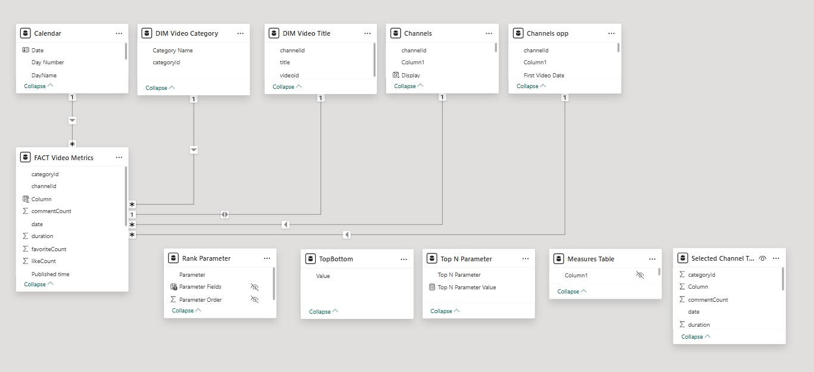

# YouTube Channel Analytics [Project](#project-overview)

This project scrapes YouTube channel data using the YouTube API, inserts it into a MySQL database, and generates summary statistics for multiple channels. The main components of the script include collecting video data (like views, likes, comments, etc.), storing it in a relational database, and generating basic statistics like the number of subscribers for each channel.

<a href="#project-overview" style="display:inline-block; padding:10px 20px; background-color:#4CAF50; color:white; text-align:center; text-decoration:none; border-radius:5px;"><h3>Python Script</h3></a>
- Power BI [BI](#bi)

## Python Script [Python Script](#script)
## Features

- **Scrapes video data** from specified YouTube channels including:
  - Video ID
  - Publish date
  - Title
  - Category ID
  - Duration
  - View count
  - Like count
  - Comment count
  - URL
  - Thumbnail URL
- **Stores data** in a MySQL database.
- **Generates summary statistics** for the channels, such as:
  - Channel name
  - Subscriber count
  - Channel image link
- Allows for easy retrieval and storage of data for further analysis.

## Requirements

- Python 3.x
- Required Python libraries:
  - `google-api-python-client`: To interact with the YouTube API.
  - `pymysql`: For interacting with the MySQL database.
  - `pandas`: For data manipulation and storing the scraped data in tabular form.

You can install the required libraries using `pip`:

```bash
pip install google-api-python-client pymysql pandas
```
- MySQL Database (for storing the scraped data)
  - A local MySQL instance must be set up. Create a database named `youtube` (or any other name of your choice, and modify the connection string in the code accordingly).

### Setup

#### Obtain a YouTube Data API Key:

1. Go to the [Google Developers Console](https://console.developers.google.com/).
2. Create a new project.
3. Enable the YouTube Data API v3.
4. Generate an API Key and replace `'API CODE HERE'` in the script with your key.

#### Set Up MySQL Database:

1. Make sure your MySQL server is running.
2. Create a database (for example `youtube`).
   
   ```sql
   CREATE DATABASE youtube;
  
3. Make sure you have the correct username and password for connecting to MySQL.
4. Update the connection details in the script accordingly.

### ▶️ Running the Script:

1. Replace the `api_key` variable with your actual **YouTube Data API key**:

   ```python
   api_key = 'YOUR_API_KEY'
   
2. Add the YouTube channel IDs that you want to track. The script includes sample channels (e.g., mrbeastid, dudeperfectid, etc.).
  - You can add or remove channel IDs as needed.

Run the script by executing:

```bash
python youtube_channel_analytics.py
```
The script will:
  - Fetch video details for the specified channels.
  - Insert the data into the MySQL database.
  - Generate a CSV file (Channels.csv) with summary statistics for each channel.

## 📌 Functions

### 🔹 `get_video_ids(channel_id)`
This function retrieves the **video IDs** of all videos from a given YouTube channel.

- **Input:**  
  - `channel_id` (*str*): The ID of the YouTube channel.

- **Output:**  
  - A **list** of video IDs.

---

### 🔹 `databaseinsertion(data)`
This function inserts the **scraped video data** into a MySQL database.

- **Input:**  
  - `data` (*Pandas DataFrame*): The video data to be inserted into the database.

- **Output:**  
  - `None` (Directly inserts data into the database).

---

### 🔹 `get_videos(channelids)`
This function collects **video data** for multiple channels.

- **Input:**  
  - `channelids` (*list of str*): A list of YouTube channel IDs.

- **Output:**  
  - Inserts the collected **video data** into the **MySQL database**.

---

### 🔹 `get_summary_statistics(channelids, channelnames, images)`
This function generates **summary statistics** for the specified channels and stores them in a CSV file.

- **Input:**  
  - `channelids` (*list of str*): List of YouTube channel IDs.  
  - `channelnames` (*list of str*): List of channel names corresponding to `channelids`.  
  - `images` (*list of str*): List of **image URLs** for the channels.

- **Output:**  
  - A **CSV file (`Channels.csv`)** containing the summary statistics.

---

## 📊 Output

### 🔹 **MySQL Database**
- A **table** named `videos` will be created with columns for video data (e.g., **video ID, publish date, view count, etc.**).

### 🔹 **CSV File (`Channels.csv`)**
- Contains **summary statistics** about the channels, including:
  - The **number of subscribers**.
  - The **channel's image link**.

### ✅ **Expected Output (`videos` table in MySQL)**

| videoid  | publisheddate | title           | categoryId | duration | viewCount | likeCount | commentCount | url                                      | thumbnailUrl                           | channelId                      |
|----------|--------------|----------------|------------|----------|-----------|-----------|--------------|------------------------------------------|----------------------------------------|--------------------------------|
| abc123   | 2025-01-01   | Sample Video 1 | 20         | PT15M    | 100000    | 2000      | 100          | [Watch Video](https://youtube.com/watch?v=abc123) |  | UCX6OQ3DkcsbYNE6H8uQQuVA |


### Power BI Desktop 
- **Data Model**:
  -  Power BI was connected to the SQL database to extract the data.
  -  The data was modeled using Power BI's data model, which integrates the video data fetched from the YouTube API(in the database), and the csv file of subscribers count and channel details.
  - Key metrics, such as total views, total likes, and total comments, were included in the model to allow for comprehensive reporting.
  - **DAX Measures**
  - A key dax procedure implemented allowed users to easily get a ranking of videos by either total likes, total views or total comments.

  <!-- Replace with the correct path -->


## Publishing to Power BI Service

- After finalizing the report in Power BI Desktop, the report was published to the Power BI Service to enable sharing and collaboration.

## Setting Up an On-Premises Data Gateway

- To enable automatic refresh of the data in Power BI Service, an On-Premises Data Gateway was set up.
  - This gateway facilitates the refresh of data from the MySQL database to Power BI.
  - The gateway ensures the data model stays up-to-date by periodically syncing the data from the local database to the cloud-based Power BI Service.

## Automating the Python Script Execution

- The Python script used to scrape data from the YouTube API is scheduled to run at regular intervals using **Windows Task Scheduler**.
  - The script fetches fresh data from YouTube, which is then inserted into the MySQL database.
  - By using Windows Scheduler, the script is automatically executed at predefined intervals without manual intervention, ensuring the data remains current.

- **Steps to Automate the Python Script**:
  - Set up a task in Windows Task Scheduler to run the script on a schedule (e.g., daily).
  - Ensure the script is executed with the correct environment and dependencies.

By combining these elements, the entire system remains automated and ensures that Power BI is always working with the most up-to-date data, providing real-time insights into YouTube channel performance.

<details>
  <summary><h2><u>Click to expand/collapse: Data Source Connection</u></h2></summary>
  
  - The data is sourced directly from the YouTube API using the `googleapiclient.discovery` package.
  - YouTube channel IDs are specified in the script, which are then used to pull data for specific channels.
  
</details>


